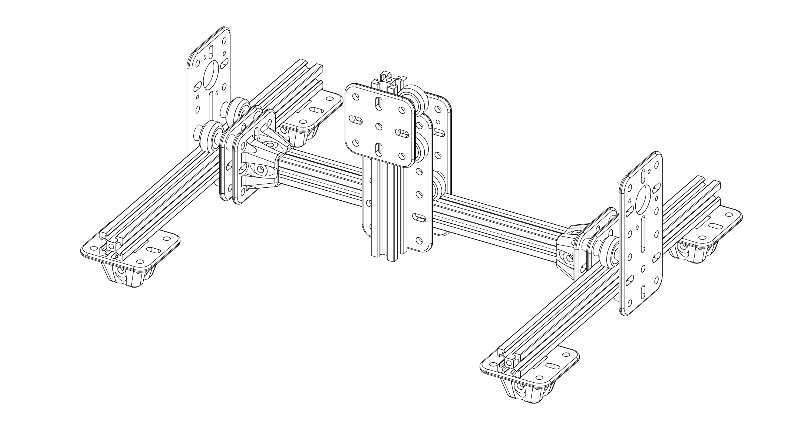
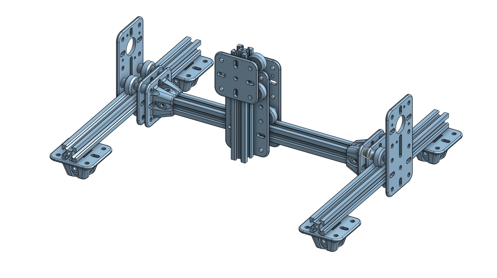
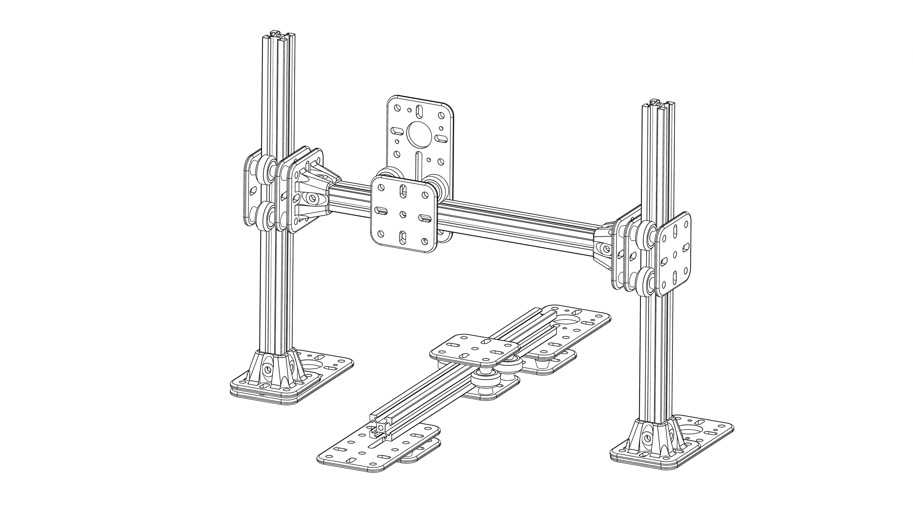
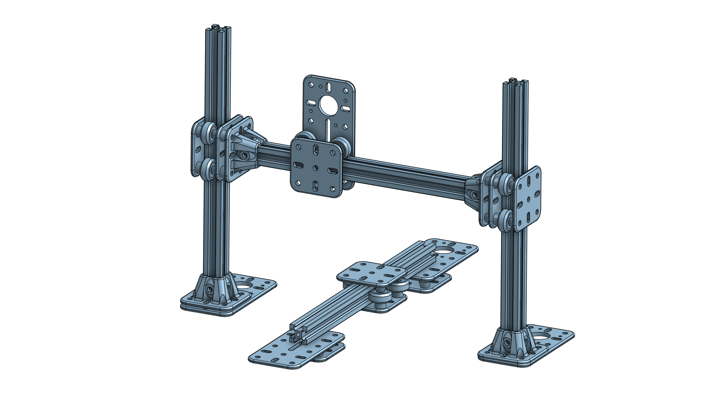

# MakerPlate by Brenden Vogt

## System Overview
- Hole spacing 20mm between centers
- Accepts 5mm bolt holes (actual size is 5.6mm. 0.6mm for tolerance)
- 4mm thickness baseplate
- slots are 6mm long
- meant to work with V Slot wheels commonly found on 3D printers

## Examples
### CNC Router / Laser Engraver

### 3D Printer

# Parts
## 1U Plate
- holes on corners and center point
- slots on center vertical and center horizontal axis

## 2U Plate
- basically two 1U plates stuck end to end.

## 1U for 2020 Extrusion
- a 1U plate with a mount for 2020 extrusion jutting out normal to the face of the 1U plate.
- Useful for mounting 2020 Extrusion perpendicular to a desk, mounting 2020 extrusion for a gantry.

## 2U for NEMA 17 Stepper Motor
- basically a 2U Plate but with a NEMA 17 motor mount on one end.

## Offsets
- Offsets are useful for separating plates in order to accommodate hardware heads such as socket head or button head bolts. 
- They are also designed to create a linear rail system where the small end of the offset rides on the inner portion of a V Wheel bearing.
