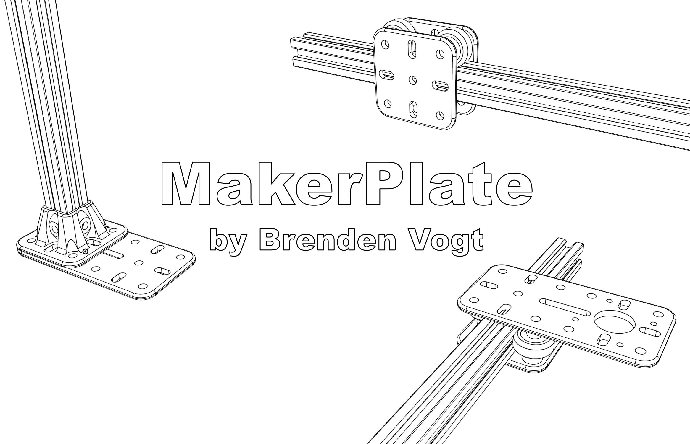

# Maker Plate by Brenden Vogt

## Overview of features
- 20 mm between centers
- Accepts 5mm bolt holes (actual size is 5.6mm. 0.6mm for tolerance)
- 4mm thickness baseplate
- slots are 6mm wide
- meant to work with V Slot wheels commonly found on 3D printers
# Parts
## 1U Plate
- holes on corners and center point
- slots on center vertical and center horizontal axis

## 2U Plate
## 1U for 2020 Extrusion
## 2U for NEMA 17 Stepper Motor

## Stepper Plate